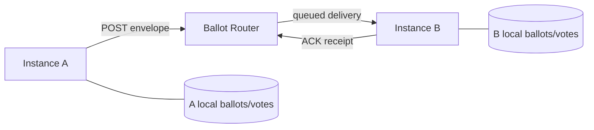
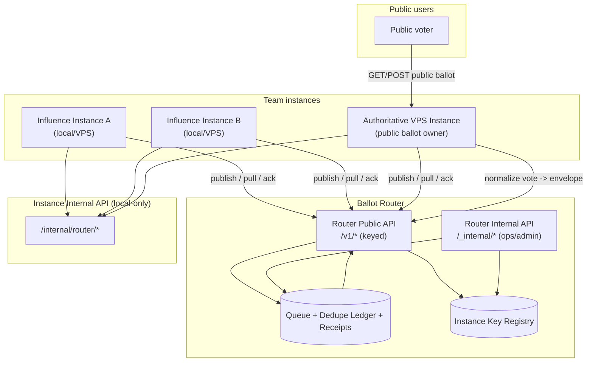

# Ballot Router Protocol (Draft v0.1)

Status: planning draft for Influence/Voice federation.

This protocol is for a **router relay** that helps local/VPS Influence instances exchange ballots and votes reliably.

## 1) Goals

1. Let users run local instances but still collaborate across instances.
2. Provide reliable delivery (queue + retry + dedupe + ack).
3. Keep each instance as source of truth for ballot content/state.
4. Keep auth lightweight initially; harden later as usage widens.

## 2) Non-goals (v0.1)

1. Full trustless federation.
2. End-user identity proofing (Privy or OAuth).
3. Router-owned canonical ballot database.

## 2.1) Agreed defaults (current)

1. **Delivery ordering**: causal/eventual ordering with idempotent handlers.
2. **Envelope TTL**: 48h default.
3. **Queue retention**:
   - Undelivered envelopes: 7 days
   - Delivery receipts: 14 days
   - Dead-letter envelopes: 30 days
4. **Encryption posture**: plaintext payloads for v0.1 (functionality first), TLS in transit.
5. **Router access**: keyed access only for router APIs (instance bearer token + HMAC envelope signature).

## 3) Topology

- **Instance**: an Influence node (local or VPS).
- **Router**: public relay service.
- **Envelope**: signed transport message carrying one event.



## 3.1) Ballot router architecture (with internal API)



Notes:
- Router is machine-to-machine for keyed participants.
- Public voters do **not** access router directly in v0.1; they submit to the authoritative VPS instance.
- Instance internal API is the boundary between local ballot logic and router transport logic.

## 4) Delivery model

Use **at-least-once** delivery.

- Router may redeliver an envelope until acknowledged.
- Recipients must dedupe by `envelopeId`.
- Event handling must be idempotent.

## 5) Envelope schema (transport contract)

```json
{
  "envelopeId": "uuid",
  "specVersion": "voice-router/v0.1",
  "eventType": "ballot.created",
  "origin": {
    "instanceId": "inst_factory_labs",
    "memberId": "member-uuid-or-null"
  },
  "target": {
    "instanceId": "inst_alice",
    "roomId": "room-uuid-or-null"
  },
  "entity": {
    "ballotId": "ballot-uuid",
    "sourceBallotId": "ballot-uuid-or-null"
  },
  "timestamps": {
    "createdAt": "2026-02-23T13:00:00.000Z",
    "expiresAt": "2026-02-24T13:00:00.000Z"
  },
  "payload": {},
  "auth": {
    "mode": "hmac-sha256",
    "keyId": "inst_factory_labs",
    "signature": "base64(hmac(canonical_json))"
  }
}
```

### Required constraints

- `envelopeId` globally unique UUID.
- `eventType` must be allow-listed.
- `createdAt` must be ISO timestamp.
- `expiresAt` optional but recommended.
- `payload` schema validated per event type.

## 6) Event types (v0.1)

1. `ballot.created`
   - Sent when a room/public ballot is distributed across instances.
2. `vote.submitted`
   - Sent from recipient instance back to ballot owner instance.
3. `results.generated`
   - Sent when owner closes ballot and generates results ballot.
4. `ballot.closed`
   - Optional explicit close signal (if results delayed).

### Event payloads

#### `ballot.created`
```json
{
  "ballot": {
    "id": "uuid",
    "title": "...",
    "description": "...",
    "voteType": "qv",
    "credits": 100,
    "visibility": "room",
    "roomId": "uuid",
    "distributedTo": ["memberId"],
    "endsAt": "ISO",
    "items": [{ "id": "item-1", "title": "...", "body": "...", "type": "statement" }]
  },
  "importHints": {
    "preserveSourceId": true
  }
}
```

#### `vote.submitted`
```json
{
  "ballotId": "uuid",
  "voter": {
    "memberId": "uuid-or-null",
    "handle": "nick"
  },
  "vote": {
    "items": [{ "itemId": "item-1", "votes": 3, "creditsCost": 9, "comment": "" }],
    "creditsUsed": 18,
    "votedAt": "ISO"
  }
}
```

#### `results.generated`
```json
{
  "sourceBallotId": "uuid",
  "resultsBallot": {
    "id": "uuid",
    "title": "Results — ...",
    "isResults": true,
    "voterCount": 4,
    "items": []
  }
}
```

## 7) API surfaces and endpoints

### 7.1 Router Public API (`/v1/*`)

When co-hosted inside the current Influence server, these are mounted at `/router/v1/*`.

All endpoints below require:
- `Authorization: Bearer <instance-token>`
- Known `instanceId`
- Valid envelope signature where applicable

| Method | Endpoint | Purpose |
|---|---|---|
| `POST` | `/v1/envelopes` | Publish an envelope to queue |
| `GET` | `/v1/envelopes/pull?limit=50&cursor=...` | Pull pending envelopes for caller instance |
| `POST` | `/v1/envelopes/ack` | Ack processed envelopes (`accepted`, `duplicate`) |
| `POST` | `/v1/envelopes/reject` | Reject malformed/unauthorized envelopes |
| `GET` | `/v1/envelopes/:envelopeId` | Inspect envelope + delivery status |
| `GET` | `/v1/health` | Router health (no sensitive payloads) |

Example publish response:
```json
{ "ok": true, "envelopeId": "uuid", "status": "queued" }
```

### 7.2 Router Internal API (`/_internal/*`)

When co-hosted inside the current Influence server, these are mounted at `/router/_internal/*`.

Used for router operations/admin tooling only (separate admin key scope).

| Method | Endpoint | Purpose |
|---|---|---|
| `POST` | `/_internal/instances/register` | Register trusted instance and issue key metadata |
| `POST` | `/_internal/instances/:instanceId/keys/rotate` | Rotate instance bearer/HMAC key |
| `GET` | `/_internal/queues/:instanceId` | Queue depth + lag + dead-letter counts |
| `POST` | `/_internal/envelopes/:envelopeId/replay` | Replay specific envelope |
| `GET` | `/_internal/audit/envelopes?instanceId=...` | Delivery audit stream |

### 7.3 Influence Instance Internal API (`/internal/router/*`)

Local-only API surface inside each Influence node (or same-process module boundary).

| Method | Endpoint | Purpose |
|---|---|---|
| `POST` | `/internal/router/publish` | Convert local domain event -> envelope -> router publish |
| `POST` | `/internal/router/ingest` | Apply pulled envelope to local stores |
| `POST` | `/internal/router/ack` | Record local receipt outcome before router ack |
| `GET` | `/internal/router/outbox` | Inspect pending outgoing envelopes |
| `POST` | `/internal/router/outbox/flush` | Force retry flush for outbox |
| `GET` | `/internal/router/health` | Router integration health |

### 7.4 Public voter path (v0.1)

Public voters submit to the authoritative Influence VPS, not directly to router.

| Method | Endpoint | Purpose |
|---|---|---|
| `GET` | `/api/public/:slug` | Read public ballot |
| `POST` | `/api/public/:slug/vote` | Submit public vote |

Authoritative instance then emits `vote.submitted` (if needed for federation) through `/v1/envelopes`.

## 8) Instance ingest rules

On envelope receive:

1. Validate signature (v0.1 HMAC).
2. Reject if unknown `eventType`.
3. Reject if expired (`expiresAt` in past).
4. Check dedupe ledger (`envelopeId` already seen).
5. Apply event idempotently.
6. Persist receipt + ack router.

## 9) Lightweight auth (now) vs stronger auth (later)

### v0.1 (now, internal rollout)

- Router and instance share static bearer tokens.
- Optional per-room shared federation secret.
- HMAC signatures over canonical JSON payload.
- Router-side allowlist of known `instanceId` values.

### v0.2 (wider rollout)

- Per-instance asymmetric keys (Ed25519).
- Router verifies detached signatures and issues short-lived tokens.
- Nonce/replay window enforcement.
- Full audit log with envelope trace IDs.

### v0.3 (public participation)

- Privy-backed voter identity for public ballots.
- Router issues voter attestation (`voterSubject`) to the ballot owner instance.
- One-vote-per-person enforced by `(ballotId, voterSubject)` uniqueness.

## 10) Public ballot one-vote policy

Do not rely on free-form `handle` for uniqueness.

Proposed key:

- `voteUniq = ballotId + voterSubject`

Where `voterSubject` is:
- v0.1 internal: instance-local memberId/handle (best effort).
- v0.3 external: Privy/OAuth stable subject.

## 11) Failure handling

1. Router unavailable: keep local outbox and retry with backoff.
2. Partial ingest: ack accepted envelopes; reject failed ones with reason codes.
3. Duplicate votes: recipient marks duplicate and acks as duplicate.
4. Split brain: source instance remains canonical for its ballots.

## 12) Suggested integration with current codebase

1. Keep existing ballot/vote stores (`ballotStore`, `voteStore`) unchanged.
2. Introduce `server/lib/routerClient.js` (publish, pull, ack).
3. Introduce `server/lib/routerIngest.js` (validate + dispatch by eventType).
4. Keep `/api/federation/*` as compatibility layer, then migrate to envelopes.

## 13) Rollout checklist

### Phase A (1 node + 1 router + 1 remote instance)
- [x] Envelope schema validator (instance-side ingest validation + signature checks)
- [x] Publish/pull/ack endpoints (instance internal + router relay stubs)
- [x] Dedupe ledger in each instance
- [x] `ballot.created` end-to-end (validated by `npm run test:router:e2e`)

### Phase B (vote/results loop)
- [x] `vote.submitted` return path
- [x] `results.generated` fanout
- [ ] Retry + dead-letter queue (retry exists via outbox backoff; dead-letter persistence still pending)

### Phase B.5 (discovery + broker control plane)
- [x] Router address-book directory (`/router/v1/directory/instances`)
- [x] Router room directory publish/list (`/router/v1/directory/rooms`)
- [x] Instance-side discovery proxy endpoints (`/internal/router/discovery/*`)
- [x] Ingest scaffolding for room join lifecycle events (`room.join.requested|approved|rejected`)
- [ ] UI for room discovery and join moderation

### Phase C (security hardening)
- [ ] Ed25519 signatures + key rotation
- [ ] Replay prevention window
- [ ] Privy voter identity for public ballots

## 14) Local end-to-end smoke test (now)

From repo root:

```bash
npm install
npm run test:router:e2e
```

What this test does:

1. Starts three local Voice servers in isolated temp data dirs:
   - one acting as router host (`/router/v1/*`, `/router/_internal/*`)
   - two acting as instances A/B (`/internal/router/*` enabled)
2. Registers both instances via router admin API.
3. Publishes `ballot.created` from A -> router.
4. Pulls+ingests on B, acks back to router.
5. Submits vote on B and verifies `vote.submitted` is ingested on A.
6. Triggers result generation on A and verifies `results.generated` is ingested on B.

Implemented by: `scripts/router-e2e-smoke.js`.

Room federation discovery/join draft: `docs/ROOM_FEDERATION_PROTOCOL.md`.

## 15) Open decisions

1. Should router retain full payloads or only encrypted payload blobs + metadata (post-v0.1)?
2. Do we require per-ballot sequence numbers in v0.1, or rely on timestamp + state guards only?
3. How much delivery telemetry should be exposed in UI?
